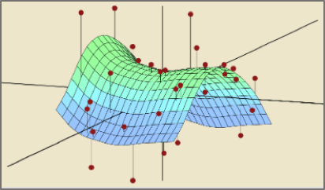

I am a greedy learner on **Massive Open Online Courses** (MOOCs). I enjoy learning something new every day and here is a list of courses I took. 

<html>
<head>
    <title></title>
</head>
<body>
 <table style="width:100%">
  <tr>
    <th>Mining Massive Datasets</th>
    <th>Statistical Learning</th> 
  </tr>
  <tr>
    <td></td>
    <td></td> 
  </tr>
  <tr>
    <td>Stanford University</td>
    <td>Stanford University</td> 
  </tr>
  <tr>
    <td><a href="./pdfs/MMDS.pdf">Statement of Accomplishment</a></td>
    <td><a href="./pdfs/SL.pdf">Statement of Accomplishment</a></td> 
  </tr>
</table>

<table style="width:100%">
  <tr>
    <th>Machine Learning</th>
    <th>Deep Learning</th> 
  </tr>
  <tr>
    <td></td>
    <td></td> 
  </tr>
  <tr>
    <td>Stanford University</td>
    <td>deeplearning.ai</td> 
  </tr>
  <tr>
    <td><a href="./pdfs/ML.pdf">Statement of Accomplishment</a></td>
    <td><a href="./pdfs/DL.pdf">Statement of Accomplishment</a></td> 
  </tr>
</table>

<table style="width:100%">
  <tr>
    <th>Data Science</th>
    <th>Machine Learning Engineer</th>
  </tr>
  <tr>
    <td></td>
    <td></td>
  </tr>
  <tr>
    <td>Johns Hopkins University</td>
    <td>Udacity</td>
  </tr>
  <tr>
    <td><a href="./pdfs/DS.pdf">Statement of Accomplishment</a></td>
    <td><a href="./pdfs/MLND.pdf">Statement of Accomplishment</a></td>
  </tr>
</table>

</body>

